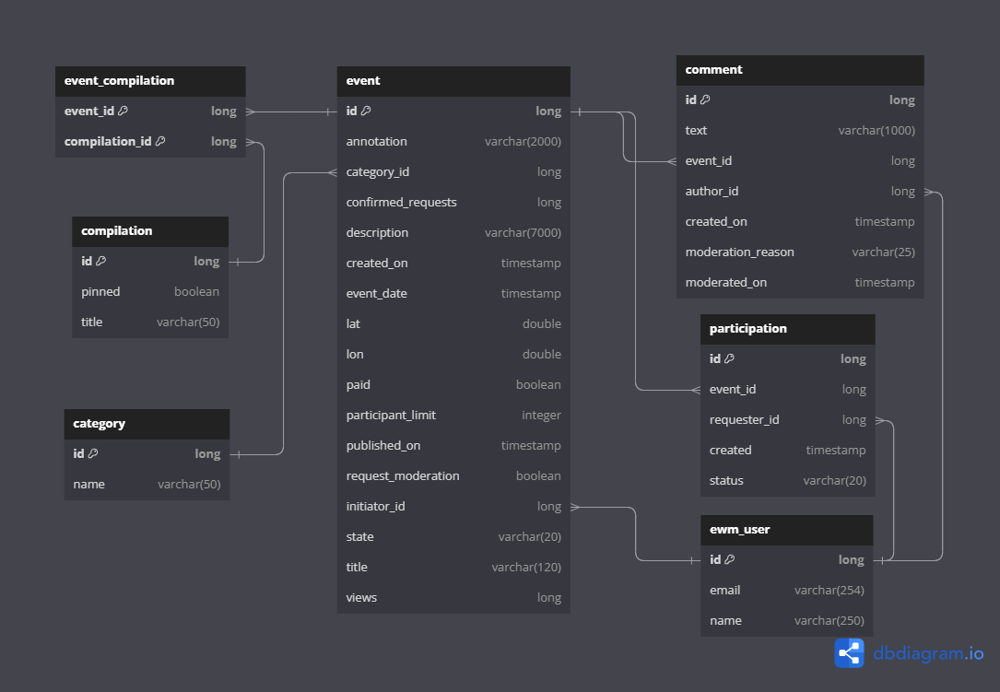

# Проект Explore With Me
## Создание backend-части приложения ExploreWithMe.

Приложение позволяет пользователям делиться информацией об интересных событиях и находить компанию для участия в них.
Состоит из основного сервиса (main-service) и сервиса статистики (stats), который сохраняет информацию о просмотрах событий в основном сервисе.

В рамках технического задания дипломной работы реализованы сервис статистики (первый этап) и основной сервис (второй этап). 

API основного сервиса состоит из трех частей:
* публичная — доступна без регистрации любому пользователю сети;
* закрытая — доступна только авторизованным пользователям;
* административная — для администраторов сервиса.

В рамках выполнения третьего этапа реализована дополнительная функциональность основного сервиса — добавление пользователями комментариев к событиям.

ER-диаграмма базы данных основного сервиса:

Для работы с комментариями реализованы следующие эндпоинты:

* GET /events/{eventId}/comments - публичный, получение списка комментариев по событию, с возможностью фильтрации по дате;
* GET /comments/{commentId} - публичный, получение конкретного комментария по id;
* GET /users/{userId}/comments - закрытый, получение пользователем списка своих комментариев;
* POST /users/{userId}/events/{eventId}/comments - закрытый, создание пользователем комментария;
* PATCH /users/{userId}/comments/{commentId} - закрытый, редактирование пользователем своего комментария;
* DELETE /users/{userId}/comments/{commentId} - закрытый, удаление пользователем своего комментария;
* PATCH /admin/comments/{commentId} - административный, модерация комментария администратором;
* DELETE /admin/comments/{commentId} - административный, удаление комментария администратором.

Ссылка на PullRequest:
